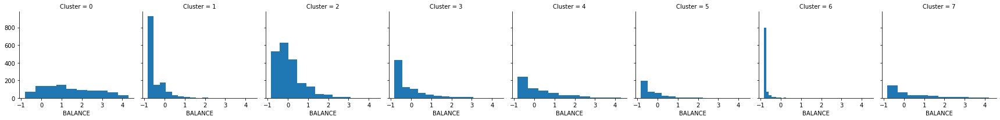

```python
import pandas as pd
import numpy as np
from sklearn.cluster import KMeans
from sklearn import preprocessing
import matplotlib.pyplot as plt
%matplotlib inline
import seaborn as sns
from scipy import stats

```


```python
df=pd.read_csv('/Users/diyachandra/Datasets/cc_info.csv')
df.head()
```


<div>
<style scoped>
    .dataframe tbody tr th:only-of-type {
        vertical-align: middle;
    }

    .dataframe tbody tr th {
        vertical-align: top;
    }

    .dataframe thead th {
        text-align: right;
    }
</style>
<table border="1" class="dataframe">
  <thead>
    <tr style="text-align: right;">
      <th></th>
      <th>CUST_ID</th>
      <th>BALANCE</th>
      <th>BALANCE_FREQUENCY</th>
      <th>PURCHASES</th>
      <th>ONEOFF_PURCHASES</th>
      <th>INSTALLMENTS_PURCHASES</th>
      <th>CASH_ADVANCE</th>
      <th>PURCHASES_FREQUENCY</th>
      <th>ONEOFF_PURCHASES_FREQUENCY</th>
      <th>PURCHASES_INSTALLMENTS_FREQUENCY</th>
      <th>CASH_ADVANCE_FREQUENCY</th>
      <th>CASH_ADVANCE_TRX</th>
      <th>PURCHASES_TRX</th>
      <th>CREDIT_LIMIT</th>
      <th>PAYMENTS</th>
      <th>MINIMUM_PAYMENTS</th>
      <th>PRC_FULL_PAYMENT</th>
      <th>TENURE</th>
    </tr>
  </thead>
  <tbody>
    <tr>
      <th>0</th>
      <td>C10001</td>
      <td>40.900749</td>
      <td>0.818182</td>
      <td>95.40</td>
      <td>0.00</td>
      <td>95.4</td>
      <td>0.000000</td>
      <td>0.166667</td>
      <td>0.000000</td>
      <td>0.083333</td>
      <td>0.000000</td>
      <td>0</td>
      <td>2</td>
      <td>1000.0</td>
      <td>201.802084</td>
      <td>139.509787</td>
      <td>0.000000</td>
      <td>12</td>
    </tr>
    <tr>
      <th>1</th>
      <td>C10002</td>
      <td>3202.467416</td>
      <td>0.909091</td>
      <td>0.00</td>
      <td>0.00</td>
      <td>0.0</td>
      <td>6442.945483</td>
      <td>0.000000</td>
      <td>0.000000</td>
      <td>0.000000</td>
      <td>0.250000</td>
      <td>4</td>
      <td>0</td>
      <td>7000.0</td>
      <td>4103.032597</td>
      <td>1072.340217</td>
      <td>0.222222</td>
      <td>12</td>
    </tr>
    <tr>
      <th>2</th>
      <td>C10003</td>
      <td>2495.148862</td>
      <td>1.000000</td>
      <td>773.17</td>
      <td>773.17</td>
      <td>0.0</td>
      <td>0.000000</td>
      <td>1.000000</td>
      <td>1.000000</td>
      <td>0.000000</td>
      <td>0.000000</td>
      <td>0</td>
      <td>12</td>
      <td>7500.0</td>
      <td>622.066742</td>
      <td>627.284787</td>
      <td>0.000000</td>
      <td>12</td>
    </tr>
    <tr>
      <th>3</th>
      <td>C10004</td>
      <td>1666.670542</td>
      <td>0.636364</td>
      <td>1499.00</td>
      <td>1499.00</td>
      <td>0.0</td>
      <td>205.788017</td>
      <td>0.083333</td>
      <td>0.083333</td>
      <td>0.000000</td>
      <td>0.083333</td>
      <td>1</td>
      <td>1</td>
      <td>7500.0</td>
      <td>0.000000</td>
      <td>NaN</td>
      <td>0.000000</td>
      <td>12</td>
    </tr>
    <tr>
      <th>4</th>
      <td>C10005</td>
      <td>817.714335</td>
      <td>1.000000</td>
      <td>16.00</td>
      <td>16.00</td>
      <td>0.0</td>
      <td>0.000000</td>
      <td>0.083333</td>
      <td>0.083333</td>
      <td>0.000000</td>
      <td>0.000000</td>
      <td>0</td>
      <td>1</td>
      <td>1200.0</td>
      <td>678.334763</td>
      <td>244.791237</td>
      <td>0.000000</td>
      <td>12</td>
    </tr>
  </tbody>
</table>
</div>


```python
df.columns.to_series().groupby(df.dtypes).groups
```


    {dtype('int64'): Index(['CASH_ADVANCE_TRX', 'PURCHASES_TRX', 'TENURE'], dtype='object'),
     dtype('float64'): Index(['BALANCE', 'BALANCE_FREQUENCY', 'PURCHASES', 'ONEOFF_PURCHASES',
            'INSTALLMENTS_PURCHASES', 'CASH_ADVANCE', 'PURCHASES_FREQUENCY',
            'ONEOFF_PURCHASES_FREQUENCY', 'PURCHASES_INSTALLMENTS_FREQUENCY',
            'CASH_ADVANCE_FREQUENCY', 'CREDIT_LIMIT', 'PAYMENTS',
            'MINIMUM_PAYMENTS', 'PRC_FULL_PAYMENT'],
           dtype='object'),
     dtype('O'): Index(['CUST_ID'], dtype='object')}


```python
df.info()
```

    <class 'pandas.core.frame.DataFrame'>
    RangeIndex: 8950 entries, 0 to 8949
    Data columns (total 18 columns):
    CUST_ID                             8950 non-null object
    BALANCE                             8950 non-null float64
    BALANCE_FREQUENCY                   8950 non-null float64
    PURCHASES                           8950 non-null float64
    ONEOFF_PURCHASES                    8950 non-null float64
    INSTALLMENTS_PURCHASES              8950 non-null float64
    CASH_ADVANCE                        8950 non-null float64
    PURCHASES_FREQUENCY                 8950 non-null float64
    ONEOFF_PURCHASES_FREQUENCY          8950 non-null float64
    PURCHASES_INSTALLMENTS_FREQUENCY    8950 non-null float64
    CASH_ADVANCE_FREQUENCY              8950 non-null float64
    CASH_ADVANCE_TRX                    8950 non-null int64
    PURCHASES_TRX                       8950 non-null int64
    CREDIT_LIMIT                        8949 non-null float64
    PAYMENTS                            8950 non-null float64
    MINIMUM_PAYMENTS                    8637 non-null float64
    PRC_FULL_PAYMENT                    8950 non-null float64
    TENURE                              8950 non-null int64
    dtypes: float64(14), int64(3), object(1)
    memory usage: 1.2+ MB


```python
null_columns=df.columns[df.isnull().any()]
df[null_columns].isnull().sum()
```


    CREDIT_LIMIT          1
    MINIMUM_PAYMENTS    313
    dtype: int64


```python
df.apply(lambda x: sum(x.isnull()/len(df)))
```


    CUST_ID                             0.000000
    BALANCE                             0.000000
    BALANCE_FREQUENCY                   0.000000
    PURCHASES                           0.000000
    ONEOFF_PURCHASES                    0.000000
    INSTALLMENTS_PURCHASES              0.000000
    CASH_ADVANCE                        0.000000
    PURCHASES_FREQUENCY                 0.000000
    ONEOFF_PURCHASES_FREQUENCY          0.000000
    PURCHASES_INSTALLMENTS_FREQUENCY    0.000000
    CASH_ADVANCE_FREQUENCY              0.000000
    CASH_ADVANCE_TRX                    0.000000
    PURCHASES_TRX                       0.000000
    CREDIT_LIMIT                        0.000112
    PAYMENTS                            0.000000
    MINIMUM_PAYMENTS                    0.034972
    PRC_FULL_PAYMENT                    0.000000
    TENURE                              0.000000
    dtype: float64


```python
df.describe()
```


<div>
<style scoped>
    .dataframe tbody tr th:only-of-type {
        vertical-align: middle;
    }

    .dataframe tbody tr th {
        vertical-align: top;
    }

    .dataframe thead th {
        text-align: right;
    }
</style>
<table border="1" class="dataframe">
  <thead>
    <tr style="text-align: right;">
      <th></th>
      <th>BALANCE</th>
      <th>BALANCE_FREQUENCY</th>
      <th>PURCHASES</th>
      <th>ONEOFF_PURCHASES</th>
      <th>INSTALLMENTS_PURCHASES</th>
      <th>CASH_ADVANCE</th>
      <th>PURCHASES_FREQUENCY</th>
      <th>ONEOFF_PURCHASES_FREQUENCY</th>
      <th>PURCHASES_INSTALLMENTS_FREQUENCY</th>
      <th>CASH_ADVANCE_FREQUENCY</th>
      <th>CASH_ADVANCE_TRX</th>
      <th>PURCHASES_TRX</th>
      <th>CREDIT_LIMIT</th>
      <th>PAYMENTS</th>
      <th>MINIMUM_PAYMENTS</th>
      <th>PRC_FULL_PAYMENT</th>
      <th>TENURE</th>
    </tr>
  </thead>
  <tbody>
    <tr>
      <th>count</th>
      <td>8950.000000</td>
      <td>8950.000000</td>
      <td>8950.000000</td>
      <td>8950.000000</td>
      <td>8950.000000</td>
      <td>8950.000000</td>
      <td>8950.000000</td>
      <td>8950.000000</td>
      <td>8950.000000</td>
      <td>8950.000000</td>
      <td>8950.000000</td>
      <td>8950.000000</td>
      <td>8949.000000</td>
      <td>8950.000000</td>
      <td>8637.000000</td>
      <td>8950.000000</td>
      <td>8950.000000</td>
    </tr>
    <tr>
      <th>mean</th>
      <td>1564.474828</td>
      <td>0.877271</td>
      <td>1003.204834</td>
      <td>592.437371</td>
      <td>411.067645</td>
      <td>978.871112</td>
      <td>0.490351</td>
      <td>0.202458</td>
      <td>0.364437</td>
      <td>0.135144</td>
      <td>3.248827</td>
      <td>14.709832</td>
      <td>4494.449450</td>
      <td>1733.143852</td>
      <td>864.206542</td>
      <td>0.153715</td>
      <td>11.517318</td>
    </tr>
    <tr>
      <th>std</th>
      <td>2081.531879</td>
      <td>0.236904</td>
      <td>2136.634782</td>
      <td>1659.887917</td>
      <td>904.338115</td>
      <td>2097.163877</td>
      <td>0.401371</td>
      <td>0.298336</td>
      <td>0.397448</td>
      <td>0.200121</td>
      <td>6.824647</td>
      <td>24.857649</td>
      <td>3638.815725</td>
      <td>2895.063757</td>
      <td>2372.446607</td>
      <td>0.292499</td>
      <td>1.338331</td>
    </tr>
    <tr>
      <th>min</th>
      <td>0.000000</td>
      <td>0.000000</td>
      <td>0.000000</td>
      <td>0.000000</td>
      <td>0.000000</td>
      <td>0.000000</td>
      <td>0.000000</td>
      <td>0.000000</td>
      <td>0.000000</td>
      <td>0.000000</td>
      <td>0.000000</td>
      <td>0.000000</td>
      <td>50.000000</td>
      <td>0.000000</td>
      <td>0.019163</td>
      <td>0.000000</td>
      <td>6.000000</td>
    </tr>
    <tr>
      <th>25%</th>
      <td>128.281915</td>
      <td>0.888889</td>
      <td>39.635000</td>
      <td>0.000000</td>
      <td>0.000000</td>
      <td>0.000000</td>
      <td>0.083333</td>
      <td>0.000000</td>
      <td>0.000000</td>
      <td>0.000000</td>
      <td>0.000000</td>
      <td>1.000000</td>
      <td>1600.000000</td>
      <td>383.276166</td>
      <td>169.123707</td>
      <td>0.000000</td>
      <td>12.000000</td>
    </tr>
    <tr>
      <th>50%</th>
      <td>873.385231</td>
      <td>1.000000</td>
      <td>361.280000</td>
      <td>38.000000</td>
      <td>89.000000</td>
      <td>0.000000</td>
      <td>0.500000</td>
      <td>0.083333</td>
      <td>0.166667</td>
      <td>0.000000</td>
      <td>0.000000</td>
      <td>7.000000</td>
      <td>3000.000000</td>
      <td>856.901546</td>
      <td>312.343947</td>
      <td>0.000000</td>
      <td>12.000000</td>
    </tr>
    <tr>
      <th>75%</th>
      <td>2054.140036</td>
      <td>1.000000</td>
      <td>1110.130000</td>
      <td>577.405000</td>
      <td>468.637500</td>
      <td>1113.821139</td>
      <td>0.916667</td>
      <td>0.300000</td>
      <td>0.750000</td>
      <td>0.222222</td>
      <td>4.000000</td>
      <td>17.000000</td>
      <td>6500.000000</td>
      <td>1901.134317</td>
      <td>825.485459</td>
      <td>0.142857</td>
      <td>12.000000</td>
    </tr>
    <tr>
      <th>max</th>
      <td>19043.138560</td>
      <td>1.000000</td>
      <td>49039.570000</td>
      <td>40761.250000</td>
      <td>22500.000000</td>
      <td>47137.211760</td>
      <td>1.000000</td>
      <td>1.000000</td>
      <td>1.000000</td>
      <td>1.500000</td>
      <td>123.000000</td>
      <td>358.000000</td>
      <td>30000.000000</td>
      <td>50721.483360</td>
      <td>76406.207520</td>
      <td>1.000000</td>
      <td>12.000000</td>
    </tr>
  </tbody>
</table>
</div>


```python
df = df.fillna( df.median())
```


```python
null_columns=df.columns[df.isnull().any()]
df[null_columns].isnull().sum()
```


    Series([], dtype: float64)


```python
sns.boxplot(data=df)
```


    <matplotlib.axes._subplots.AxesSubplot at 0x110751208>


```python
df = df.drop(columns = 'CUST_ID', axis = 1)
```


```python
z = np.abs(stats.zscore(df))
print(z)
```

    [[0.73198937 0.24943448 0.42489974 ... 0.3024     0.52555097 0.36067954]
     [0.78696085 0.13432467 0.46955188 ... 0.09749953 0.2342269  0.36067954]
     [0.44713513 0.51808382 0.10766823 ... 0.0932934  0.52555097 0.36067954]
     ...
     [0.7403981  0.18547673 0.40196519 ... 0.32687479 0.32919999 4.12276757]
     [0.74517423 0.18547673 0.46955188 ... 0.33830497 0.32919999 4.12276757]
     [0.57257511 0.88903307 0.04214581 ... 0.3243581  0.52555097 4.12276757]]


```python
df_of = pd.DataFrame(df[(z < 3).all(axis=1)], columns = df.columns)
```


```python
df_of.describe()
```


<div>
<style scoped>
    .dataframe tbody tr th:only-of-type {
        vertical-align: middle;
    }

    .dataframe tbody tr th {
        vertical-align: top;
    }

    .dataframe thead th {
        text-align: right;
    }
</style>
<table border="1" class="dataframe">
  <thead>
    <tr style="text-align: right;">
      <th></th>
      <th>BALANCE</th>
      <th>BALANCE_FREQUENCY</th>
      <th>PURCHASES</th>
      <th>ONEOFF_PURCHASES</th>
      <th>INSTALLMENTS_PURCHASES</th>
      <th>CASH_ADVANCE</th>
      <th>PURCHASES_FREQUENCY</th>
      <th>ONEOFF_PURCHASES_FREQUENCY</th>
      <th>PURCHASES_INSTALLMENTS_FREQUENCY</th>
      <th>CASH_ADVANCE_FREQUENCY</th>
      <th>CASH_ADVANCE_TRX</th>
      <th>PURCHASES_TRX</th>
      <th>CREDIT_LIMIT</th>
      <th>PAYMENTS</th>
      <th>MINIMUM_PAYMENTS</th>
      <th>PRC_FULL_PAYMENT</th>
      <th>TENURE</th>
    </tr>
  </thead>
  <tbody>
    <tr>
      <th>count</th>
      <td>7434.000000</td>
      <td>7434.000000</td>
      <td>7434.000000</td>
      <td>7434.000000</td>
      <td>7434.000000</td>
      <td>7434.000000</td>
      <td>7434.000000</td>
      <td>7434.000000</td>
      <td>7434.000000</td>
      <td>7434.000000</td>
      <td>7434.000000</td>
      <td>7434.000000</td>
      <td>7434.000000</td>
      <td>7434.000000</td>
      <td>7434.000000</td>
      <td>7434.000000</td>
      <td>7434.000000</td>
    </tr>
    <tr>
      <th>mean</th>
      <td>1269.831784</td>
      <td>0.889646</td>
      <td>753.123265</td>
      <td>431.275673</td>
      <td>322.112279</td>
      <td>671.957249</td>
      <td>0.485746</td>
      <td>0.192344</td>
      <td>0.357495</td>
      <td>0.109677</td>
      <td>2.314501</td>
      <td>12.057842</td>
      <td>3999.597543</td>
      <td>1297.565656</td>
      <td>577.475186</td>
      <td>0.154570</td>
      <td>11.750740</td>
    </tr>
    <tr>
      <th>std</th>
      <td>1517.952340</td>
      <td>0.213397</td>
      <td>1025.441760</td>
      <td>793.561465</td>
      <td>506.012658</td>
      <td>1235.334487</td>
      <td>0.396350</td>
      <td>0.287619</td>
      <td>0.392628</td>
      <td>0.158778</td>
      <td>3.941055</td>
      <td>15.120242</td>
      <td>2935.900739</td>
      <td>1436.498465</td>
      <td>776.332267</td>
      <td>0.290825</td>
      <td>0.798485</td>
    </tr>
    <tr>
      <th>min</th>
      <td>0.001214</td>
      <td>0.181818</td>
      <td>0.000000</td>
      <td>0.000000</td>
      <td>0.000000</td>
      <td>0.000000</td>
      <td>0.000000</td>
      <td>0.000000</td>
      <td>0.000000</td>
      <td>0.000000</td>
      <td>0.000000</td>
      <td>0.000000</td>
      <td>50.000000</td>
      <td>0.000000</td>
      <td>0.019163</td>
      <td>0.000000</td>
      <td>8.000000</td>
    </tr>
    <tr>
      <th>25%</th>
      <td>120.946159</td>
      <td>0.909091</td>
      <td>46.687500</td>
      <td>0.000000</td>
      <td>0.000000</td>
      <td>0.000000</td>
      <td>0.083333</td>
      <td>0.000000</td>
      <td>0.000000</td>
      <td>0.000000</td>
      <td>0.000000</td>
      <td>1.000000</td>
      <td>1500.000000</td>
      <td>390.216308</td>
      <td>167.947384</td>
      <td>0.000000</td>
      <td>12.000000</td>
    </tr>
    <tr>
      <th>50%</th>
      <td>790.090769</td>
      <td>1.000000</td>
      <td>360.955000</td>
      <td>35.000000</td>
      <td>88.915000</td>
      <td>0.000000</td>
      <td>0.500000</td>
      <td>0.083333</td>
      <td>0.166667</td>
      <td>0.000000</td>
      <td>0.000000</td>
      <td>7.000000</td>
      <td>3000.000000</td>
      <td>797.938345</td>
      <td>291.135341</td>
      <td>0.000000</td>
      <td>12.000000</td>
    </tr>
    <tr>
      <th>75%</th>
      <td>1750.662783</td>
      <td>1.000000</td>
      <td>1023.372500</td>
      <td>520.000000</td>
      <td>443.250000</td>
      <td>889.266455</td>
      <td>0.916667</td>
      <td>0.250000</td>
      <td>0.750000</td>
      <td>0.166667</td>
      <td>3.000000</td>
      <td>16.000000</td>
      <td>6000.000000</td>
      <td>1626.296448</td>
      <td>680.429004</td>
      <td>0.166667</td>
      <td>12.000000</td>
    </tr>
    <tr>
      <th>max</th>
      <td>7803.071972</td>
      <td>1.000000</td>
      <td>7323.380000</td>
      <td>5497.040000</td>
      <td>3119.280000</td>
      <td>7232.069823</td>
      <td>1.000000</td>
      <td>1.000000</td>
      <td>1.000000</td>
      <td>0.727273</td>
      <td>23.000000</td>
      <td>89.000000</td>
      <td>15000.000000</td>
      <td>10226.601760</td>
      <td>7781.671432</td>
      <td>1.000000</td>
      <td>12.000000</td>
    </tr>
  </tbody>
</table>
</div>


```python
sns.boxplot(data=df_of)
```


    <matplotlib.axes._subplots.AxesSubplot at 0x12dcf3eb8>


```python
from sklearn.preprocessing import StandardScaler
scaler = StandardScaler()
df_standardized = scaler.fit_transform(df_of)
df_standardized = pd.DataFrame(df_standardized, columns = df.columns)
df_standardized.head()
```


<div>
<style scoped>
    .dataframe tbody tr th:only-of-type {
        vertical-align: middle;
    }

    .dataframe tbody tr th {
        vertical-align: top;
    }

    .dataframe thead th {
        text-align: right;
    }
</style>
<table border="1" class="dataframe">
  <thead>
    <tr style="text-align: right;">
      <th></th>
      <th>BALANCE</th>
      <th>BALANCE_FREQUENCY</th>
      <th>PURCHASES</th>
      <th>ONEOFF_PURCHASES</th>
      <th>INSTALLMENTS_PURCHASES</th>
      <th>CASH_ADVANCE</th>
      <th>PURCHASES_FREQUENCY</th>
      <th>ONEOFF_PURCHASES_FREQUENCY</th>
      <th>PURCHASES_INSTALLMENTS_FREQUENCY</th>
      <th>CASH_ADVANCE_FREQUENCY</th>
      <th>CASH_ADVANCE_TRX</th>
      <th>PURCHASES_TRX</th>
      <th>CREDIT_LIMIT</th>
      <th>PAYMENTS</th>
      <th>MINIMUM_PAYMENTS</th>
      <th>PRC_FULL_PAYMENT</th>
      <th>TENURE</th>
    </tr>
  </thead>
  <tbody>
    <tr>
      <th>0</th>
      <td>-0.809652</td>
      <td>-0.334911</td>
      <td>-0.641448</td>
      <td>-0.543505</td>
      <td>-0.448067</td>
      <td>-0.543984</td>
      <td>-0.805098</td>
      <td>-0.668791</td>
      <td>-0.698321</td>
      <td>-0.690806</td>
      <td>-0.587319</td>
      <td>-0.665235</td>
      <td>-1.021765</td>
      <td>-0.762853</td>
      <td>-0.564185</td>
      <td>-0.531523</td>
      <td>0.312187</td>
    </tr>
    <tr>
      <th>1</th>
      <td>1.273272</td>
      <td>0.091127</td>
      <td>-0.734487</td>
      <td>-0.543505</td>
      <td>-0.636612</td>
      <td>4.671914</td>
      <td>-1.225631</td>
      <td>-0.668791</td>
      <td>-0.910579</td>
      <td>0.883825</td>
      <td>0.427706</td>
      <td>-0.797517</td>
      <td>1.022039</td>
      <td>1.953121</td>
      <td>0.637483</td>
      <td>0.232637</td>
      <td>0.312187</td>
    </tr>
    <tr>
      <th>2</th>
      <td>0.807271</td>
      <td>0.517164</td>
      <td>0.019551</td>
      <td>0.430864</td>
      <td>-0.636612</td>
      <td>-0.543984</td>
      <td>1.297564</td>
      <td>2.808268</td>
      <td>-0.910579</td>
      <td>-0.690806</td>
      <td>-0.587319</td>
      <td>-0.003826</td>
      <td>1.192356</td>
      <td>-0.470272</td>
      <td>0.064164</td>
      <td>-0.531523</td>
      <td>0.312187</td>
    </tr>
    <tr>
      <th>3</th>
      <td>0.261448</td>
      <td>-1.186986</td>
      <td>0.727420</td>
      <td>1.345575</td>
      <td>-0.636612</td>
      <td>-0.377388</td>
      <td>-1.015366</td>
      <td>-0.379037</td>
      <td>-0.910579</td>
      <td>-0.165931</td>
      <td>-0.333563</td>
      <td>-0.731376</td>
      <td>1.192356</td>
      <td>-0.903344</td>
      <td>-0.341541</td>
      <td>-0.531523</td>
      <td>0.312187</td>
    </tr>
    <tr>
      <th>4</th>
      <td>-0.297867</td>
      <td>0.517164</td>
      <td>-0.718883</td>
      <td>-0.523341</td>
      <td>-0.636612</td>
      <td>-0.543984</td>
      <td>-1.015366</td>
      <td>-0.379037</td>
      <td>-0.910579</td>
      <td>-0.690806</td>
      <td>-0.587319</td>
      <td>-0.731376</td>
      <td>-0.953638</td>
      <td>-0.431099</td>
      <td>-0.428562</td>
      <td>-0.531523</td>
      <td>0.312187</td>
    </tr>
  </tbody>
</table>
</div>


```python
num_clusters = 20
n_inertias = np.zeros((1, num_clusters))
from sklearn.cluster import KMeans
for i in range(0, num_clusters):
    k_means = KMeans(i+1)
    k_means.fit(df_standardized)
    n_inertias[0, i] = k_means.inertia_
```


```python
plt.figure(figsize =  (12, 5))
plt.plot(n_inertias.flatten())
plt.xticks(range(0, num_clusters, 1))
plt.title('Using elbow method to find number of clusters')
plt.xlabel('No. of clusters')
plt.ylabel('inertias')
plt.draw()
```


```python
kmeans = KMeans(n_clusters=8, init='k-means++', max_iter=300, n_init=10, random_state=0)
y_kmeans = kmeans.fit_predict(df_standardized)
```


```python
df_out = pd.concat([df_standardized, pd.DataFrame({'Cluster': y_kmeans})], axis = 1)
```


```python
df_out.head()
```


<div>
<style scoped>
    .dataframe tbody tr th:only-of-type {
        vertical-align: middle;
    }

    .dataframe tbody tr th {
        vertical-align: top;
    }

    .dataframe thead th {
        text-align: right;
    }
</style>
<table border="1" class="dataframe">
  <thead>
    <tr style="text-align: right;">
      <th></th>
      <th>BALANCE</th>
      <th>BALANCE_FREQUENCY</th>
      <th>PURCHASES</th>
      <th>ONEOFF_PURCHASES</th>
      <th>INSTALLMENTS_PURCHASES</th>
      <th>CASH_ADVANCE</th>
      <th>PURCHASES_FREQUENCY</th>
      <th>ONEOFF_PURCHASES_FREQUENCY</th>
      <th>PURCHASES_INSTALLMENTS_FREQUENCY</th>
      <th>CASH_ADVANCE_FREQUENCY</th>
      <th>CASH_ADVANCE_TRX</th>
      <th>PURCHASES_TRX</th>
      <th>CREDIT_LIMIT</th>
      <th>PAYMENTS</th>
      <th>MINIMUM_PAYMENTS</th>
      <th>PRC_FULL_PAYMENT</th>
      <th>TENURE</th>
      <th>Cluster</th>
    </tr>
  </thead>
  <tbody>
    <tr>
      <th>0</th>
      <td>-0.809652</td>
      <td>-0.334911</td>
      <td>-0.641448</td>
      <td>-0.543505</td>
      <td>-0.448067</td>
      <td>-0.543984</td>
      <td>-0.805098</td>
      <td>-0.668791</td>
      <td>-0.698321</td>
      <td>-0.690806</td>
      <td>-0.587319</td>
      <td>-0.665235</td>
      <td>-1.021765</td>
      <td>-0.762853</td>
      <td>-0.564185</td>
      <td>-0.531523</td>
      <td>0.312187</td>
      <td>2</td>
    </tr>
    <tr>
      <th>1</th>
      <td>1.273272</td>
      <td>0.091127</td>
      <td>-0.734487</td>
      <td>-0.543505</td>
      <td>-0.636612</td>
      <td>4.671914</td>
      <td>-1.225631</td>
      <td>-0.668791</td>
      <td>-0.910579</td>
      <td>0.883825</td>
      <td>0.427706</td>
      <td>-0.797517</td>
      <td>1.022039</td>
      <td>1.953121</td>
      <td>0.637483</td>
      <td>0.232637</td>
      <td>0.312187</td>
      <td>0</td>
    </tr>
    <tr>
      <th>2</th>
      <td>0.807271</td>
      <td>0.517164</td>
      <td>0.019551</td>
      <td>0.430864</td>
      <td>-0.636612</td>
      <td>-0.543984</td>
      <td>1.297564</td>
      <td>2.808268</td>
      <td>-0.910579</td>
      <td>-0.690806</td>
      <td>-0.587319</td>
      <td>-0.003826</td>
      <td>1.192356</td>
      <td>-0.470272</td>
      <td>0.064164</td>
      <td>-0.531523</td>
      <td>0.312187</td>
      <td>3</td>
    </tr>
    <tr>
      <th>3</th>
      <td>0.261448</td>
      <td>-1.186986</td>
      <td>0.727420</td>
      <td>1.345575</td>
      <td>-0.636612</td>
      <td>-0.377388</td>
      <td>-1.015366</td>
      <td>-0.379037</td>
      <td>-0.910579</td>
      <td>-0.165931</td>
      <td>-0.333563</td>
      <td>-0.731376</td>
      <td>1.192356</td>
      <td>-0.903344</td>
      <td>-0.341541</td>
      <td>-0.531523</td>
      <td>0.312187</td>
      <td>6</td>
    </tr>
    <tr>
      <th>4</th>
      <td>-0.297867</td>
      <td>0.517164</td>
      <td>-0.718883</td>
      <td>-0.523341</td>
      <td>-0.636612</td>
      <td>-0.543984</td>
      <td>-1.015366</td>
      <td>-0.379037</td>
      <td>-0.910579</td>
      <td>-0.690806</td>
      <td>-0.587319</td>
      <td>-0.731376</td>
      <td>-0.953638</td>
      <td>-0.431099</td>
      <td>-0.428562</td>
      <td>-0.531523</td>
      <td>0.312187</td>
      <td>2</td>
    </tr>
  </tbody>
</table>
</div>


```python
for cols in df_standardized:
    g = sns.FacetGrid(df_out, col = 'Cluster')
    g.map(plt.hist, cols)
```





```python
df_out.groupby(['Cluster']).size()
```


    Cluster
    0     957
    1    1395
    2    1999
    3     828
    4     592
    5     384
    6     938
    7     341
    dtype: int64


```python
df_out = df_out.groupby(by='Cluster').mean()
df_out = df_out[['BALANCE','BALANCE_FREQUENCY', 'PURCHASES',
                               'PURCHASES_FREQUENCY','CREDIT_LIMIT',  
                              'MINIMUM_PAYMENTS','PRC_FULL_PAYMENT',
                               'PAYMENTS','INSTALLMENTS_PURCHASES','TENURE', 'CASH_ADVANCE']]
df_out
```


<div>
<style scoped>
    .dataframe tbody tr th:only-of-type {
        vertical-align: middle;
    }

    .dataframe tbody tr th {
        vertical-align: top;
    }

    .dataframe thead th {
        text-align: right;
    }
</style>
<table border="1" class="dataframe">
  <thead>
    <tr style="text-align: right;">
      <th></th>
      <th>BALANCE</th>
      <th>BALANCE_FREQUENCY</th>
      <th>PURCHASES</th>
      <th>PURCHASES_FREQUENCY</th>
      <th>CREDIT_LIMIT</th>
      <th>MINIMUM_PAYMENTS</th>
      <th>PRC_FULL_PAYMENT</th>
      <th>PAYMENTS</th>
      <th>INSTALLMENTS_PURCHASES</th>
      <th>TENURE</th>
      <th>CASH_ADVANCE</th>
    </tr>
    <tr>
      <th>Cluster</th>
      <th></th>
      <th></th>
      <th></th>
      <th></th>
      <th></th>
      <th></th>
      <th></th>
      <th></th>
      <th></th>
      <th></th>
      <th></th>
    </tr>
  </thead>
  <tbody>
    <tr>
      <th>0</th>
      <td>1.393394</td>
      <td>0.359162</td>
      <td>-0.429993</td>
      <td>-0.638116</td>
      <td>0.610189</td>
      <td>0.820241</td>
      <td>-0.430936</td>
      <td>0.682069</td>
      <td>-0.414483</td>
      <td>0.092320</td>
      <td>1.838057</td>
    </tr>
    <tr>
      <th>1</th>
      <td>-0.520715</td>
      <td>0.278034</td>
      <td>-0.158941</td>
      <td>0.960422</td>
      <td>-0.343386</td>
      <td>-0.279032</td>
      <td>0.406823</td>
      <td>-0.405004</td>
      <td>0.347372</td>
      <td>0.208938</td>
      <td>-0.478009</td>
    </tr>
    <tr>
      <th>2</th>
      <td>0.052962</td>
      <td>0.411454</td>
      <td>-0.562866</td>
      <td>-0.884353</td>
      <td>-0.350781</td>
      <td>0.027879</td>
      <td>-0.473144</td>
      <td>-0.337499</td>
      <td>-0.558408</td>
      <td>0.228857</td>
      <td>-0.139174</td>
    </tr>
    <tr>
      <th>3</th>
      <td>-0.129725</td>
      <td>0.343468</td>
      <td>0.592132</td>
      <td>0.758545</td>
      <td>0.419667</td>
      <td>-0.184347</td>
      <td>0.219251</td>
      <td>0.059783</td>
      <td>-0.256254</td>
      <td>0.206303</td>
      <td>-0.424098</td>
    </tr>
    <tr>
      <th>4</th>
      <td>0.227349</td>
      <td>0.376831</td>
      <td>1.218527</td>
      <td>1.114310</td>
      <td>0.434492</td>
      <td>0.481930</td>
      <td>0.109775</td>
      <td>0.594711</td>
      <td>2.179464</td>
      <td>0.286800</td>
      <td>-0.222899</td>
    </tr>
    <tr>
      <th>5</th>
      <td>-0.323761</td>
      <td>-0.358013</td>
      <td>-0.321734</td>
      <td>-0.191913</td>
      <td>-0.533804</td>
      <td>-0.293974</td>
      <td>0.017188</td>
      <td>-0.431919</td>
      <td>-0.285838</td>
      <td>-3.702847</td>
      <td>0.138024</td>
    </tr>
    <tr>
      <th>6</th>
      <td>-0.767400</td>
      <td>-2.190766</td>
      <td>-0.428796</td>
      <td>-0.582133</td>
      <td>-0.142134</td>
      <td>-0.550362</td>
      <td>0.380582</td>
      <td>-0.263436</td>
      <td>-0.383804</td>
      <td>0.184004</td>
      <td>-0.340269</td>
    </tr>
    <tr>
      <th>7</th>
      <td>0.305029</td>
      <td>0.383776</td>
      <td>3.145157</td>
      <td>1.087090</td>
      <td>0.967397</td>
      <td>0.131996</td>
      <td>0.529588</td>
      <td>1.754520</td>
      <td>1.231788</td>
      <td>0.209346</td>
      <td>-0.189760</td>
    </tr>
  </tbody>
</table>
</div>


```python
df_out.sort_values(by=['CREDIT_LIMIT'])
```


<div>
<style scoped>
    .dataframe tbody tr th:only-of-type {
        vertical-align: middle;
    }

    .dataframe tbody tr th {
        vertical-align: top;
    }

    .dataframe thead th {
        text-align: right;
    }
</style>
<table border="1" class="dataframe">
  <thead>
    <tr style="text-align: right;">
      <th></th>
      <th>BALANCE</th>
      <th>BALANCE_FREQUENCY</th>
      <th>PURCHASES</th>
      <th>PURCHASES_FREQUENCY</th>
      <th>CREDIT_LIMIT</th>
      <th>MINIMUM_PAYMENTS</th>
      <th>PRC_FULL_PAYMENT</th>
      <th>PAYMENTS</th>
      <th>INSTALLMENTS_PURCHASES</th>
      <th>TENURE</th>
      <th>CASH_ADVANCE</th>
    </tr>
    <tr>
      <th>Cluster</th>
      <th></th>
      <th></th>
      <th></th>
      <th></th>
      <th></th>
      <th></th>
      <th></th>
      <th></th>
      <th></th>
      <th></th>
      <th></th>
    </tr>
  </thead>
  <tbody>
    <tr>
      <th>5</th>
      <td>-0.323761</td>
      <td>-0.358013</td>
      <td>-0.321734</td>
      <td>-0.191913</td>
      <td>-0.533804</td>
      <td>-0.293974</td>
      <td>0.017188</td>
      <td>-0.431919</td>
      <td>-0.285838</td>
      <td>-3.702847</td>
      <td>0.138024</td>
    </tr>
    <tr>
      <th>2</th>
      <td>0.052962</td>
      <td>0.411454</td>
      <td>-0.562866</td>
      <td>-0.884353</td>
      <td>-0.350781</td>
      <td>0.027879</td>
      <td>-0.473144</td>
      <td>-0.337499</td>
      <td>-0.558408</td>
      <td>0.228857</td>
      <td>-0.139174</td>
    </tr>
    <tr>
      <th>1</th>
      <td>-0.520715</td>
      <td>0.278034</td>
      <td>-0.158941</td>
      <td>0.960422</td>
      <td>-0.343386</td>
      <td>-0.279032</td>
      <td>0.406823</td>
      <td>-0.405004</td>
      <td>0.347372</td>
      <td>0.208938</td>
      <td>-0.478009</td>
    </tr>
    <tr>
      <th>6</th>
      <td>-0.767400</td>
      <td>-2.190766</td>
      <td>-0.428796</td>
      <td>-0.582133</td>
      <td>-0.142134</td>
      <td>-0.550362</td>
      <td>0.380582</td>
      <td>-0.263436</td>
      <td>-0.383804</td>
      <td>0.184004</td>
      <td>-0.340269</td>
    </tr>
    <tr>
      <th>3</th>
      <td>-0.129725</td>
      <td>0.343468</td>
      <td>0.592132</td>
      <td>0.758545</td>
      <td>0.419667</td>
      <td>-0.184347</td>
      <td>0.219251</td>
      <td>0.059783</td>
      <td>-0.256254</td>
      <td>0.206303</td>
      <td>-0.424098</td>
    </tr>
    <tr>
      <th>4</th>
      <td>0.227349</td>
      <td>0.376831</td>
      <td>1.218527</td>
      <td>1.114310</td>
      <td>0.434492</td>
      <td>0.481930</td>
      <td>0.109775</td>
      <td>0.594711</td>
      <td>2.179464</td>
      <td>0.286800</td>
      <td>-0.222899</td>
    </tr>
    <tr>
      <th>0</th>
      <td>1.393394</td>
      <td>0.359162</td>
      <td>-0.429993</td>
      <td>-0.638116</td>
      <td>0.610189</td>
      <td>0.820241</td>
      <td>-0.430936</td>
      <td>0.682069</td>
      <td>-0.414483</td>
      <td>0.092320</td>
      <td>1.838057</td>
    </tr>
    <tr>
      <th>7</th>
      <td>0.305029</td>
      <td>0.383776</td>
      <td>3.145157</td>
      <td>1.087090</td>
      <td>0.967397</td>
      <td>0.131996</td>
      <td>0.529588</td>
      <td>1.754520</td>
      <td>1.231788</td>
      <td>0.209346</td>
      <td>-0.189760</td>
    </tr>
  </tbody>
</table>
</div>


Cluster 4: People with very high purchase rate and highest credit limit. Thet also make full payments on time.They are the lowest risk customers. Target them for good signup offers.

Cluster 1: People who make least use of credit cards and have moderately low credit limit.They are the largest batch of people.

Cluster 6: Make low amount of new purchases but make minimum payments to pay off the dues. Have moderately high credit limit.

Cluster 7: Customers with lowest duration of card use. They appear to have low credit limits and also make few number of purchases.

Cluster 5: Second largest group of people. They are average customers who make a lot of low valued purchases and pay in full. These customers generate low revenue for the company.

Cluster 0: This group of customers have highest dues. They also make highest number of minimum payments. These customers are possibly higher risk than other groups. This is also the smallest group of people

Cluster 2: Make high purchases and pay the dues. They have low balance. Also have moderately high credit limit. They are low risk customers.

Cluster 3: Have the lowest balance. Purchases are also less. They seem to make no use of their credit cards. These customers are mostly inactive. They also have moderately low credit limit.


```python

```
